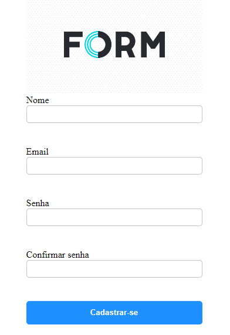

<p align="center"> 

</p>
<h1 align="center">Formulário no React</h1>

<p> Nesse projeto fiz um formulário no React. Onde utilizei o React Hook Forms que facilita muito na criação de formulário, fazendo validação dos campos, como criar um Schema do formulário e também como verificar todos os dados do formulário. </p>

## 🖥 Demo:

- [Aplicação](https://flourishing-platypus-ff8700.netlify.app/)


## :rocket: Tecnologias ##

- [React](https://pt-br.reactjs.org/)
- [JavaScript](https://developer.mozilla.org/pt-BR/docs/Web/JavaScript) 
- [Html](https://developer.mozilla.org/pt-BR/docs/Web/HTML/Element/html/)  
- [CSS](https://developer.mozilla.org/pt-BR/docs/Web/CSS)  

## :white_check_mark: Requisitos ##

Antes de iniciar é necessário instalar o [Git](https://git-scm.com).

## :checkered_flag: Iniciando ##

```bash
# Clone este projeto
$ git clone https://github.com/miguelfiais/forms-react.git
# Acesso
$ cd forms-react
# Instale as dependências
$ yarn or npm 
# Rode o projeto
$ yarn dev ou npm run dev
```

Projeto desenvolvido por <a href="https://github.com/miguelfiais"> Miguel Fiais </a> 
